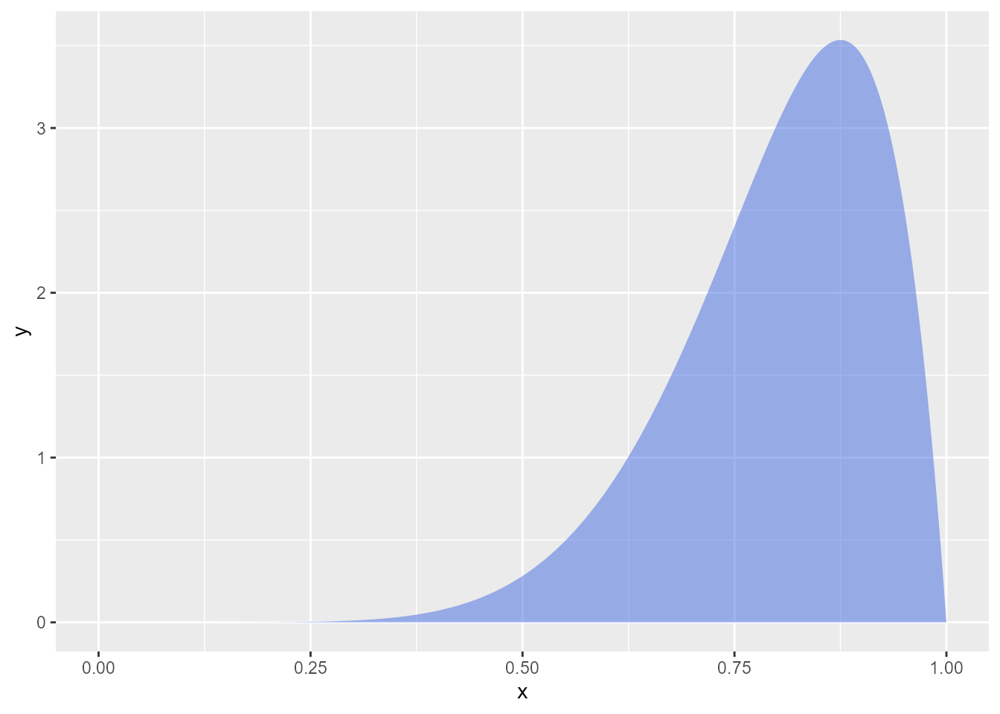

```{r}
#install.packages("remotes")
#remotes::install_github("DevPsyLab/petersenlab")
```

# Intro

# Preamble

## Install Libraries

<!-- *IMPORTANT NOTE*: Because of how pandoc works, the figure and table labels must be all lowercase for cross-references to work -->

## Load Libraries

```{r}
#| message: false
#| warning: false

```

## Load Data

# Plots

```{r}
#| label: fig-mtcars2
#| fig-cap: "My Figure Caption"
#| apa-note: "My APA-style figure note."

plot(mtcars)
```

{
  #fig-example2
  fig-alt="Insert description here."
  apa-note="Variable A indirectly causes Variable C."
  }

# Session Info

```{r}
sessionInfo()
```

## Rstudio Version

```{r}
#rstudioapi::versionInfo()
```
